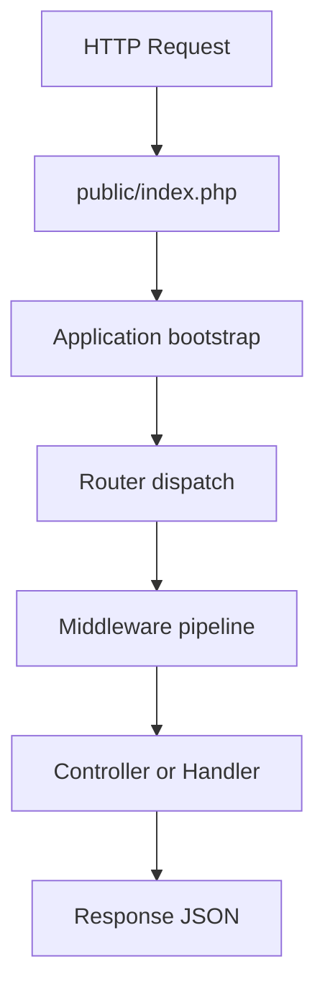
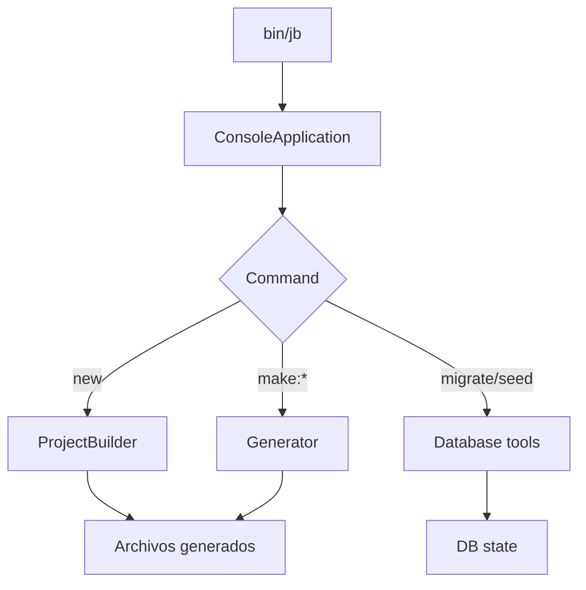
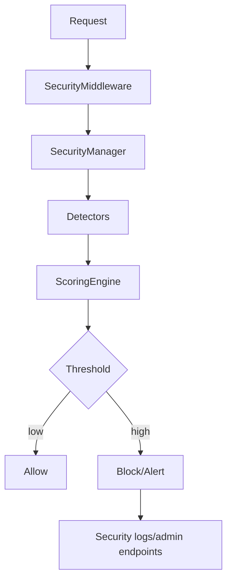

# Diagramas conceptuales

## 1. Ciclo HTTP



## 2. Middleware pipeline

```text
Request
  -> SecurityMiddleware
  -> AuthMiddleware (si aplica)
  -> PermissionMiddleware (si aplica)
  -> RateLimitMiddleware (si aplica)
  -> Handler
  -> Response
```

## 3. Flujo CLI



## 4. Container bindings

```text
Application::bootstrap
  -> Config
  -> Router
  -> Connection
  -> Logger
  -> Cache
  -> RateLimiter
  -> Mailer
```

## 5. Flujo de autenticacion

```text
Login endpoint
  -> AuthService (emision de tokens)
  -> JWT::encode
  -> access_token + refresh_token
```

## 6. Flujo JWT

```text
Authorization: Bearer <token>
  -> AuthMiddleware
  -> JWT::decode
  -> claims al Request
  -> PermissionMiddleware valida permisos
```

## 7. Arquitectura multi-driver

```text
Config database.driver
  -> Connection (PDO)
  -> QueryBuilder(table, driver)
  -> SQL con quoting segun driver
```

## 8. Relacion QueryBuilder y Grammar

### Implementado

```text
QueryBuilder
  -> estrategia interna por driver (quote y diferencias SQL basicas)
```

### Planeado

```text
QueryBuilder
  -> Grammar interface
      -> MySqlGrammar
      -> PgSqlGrammar
      -> SqliteGrammar
```

## 9. Arquitectura del modulo Security


